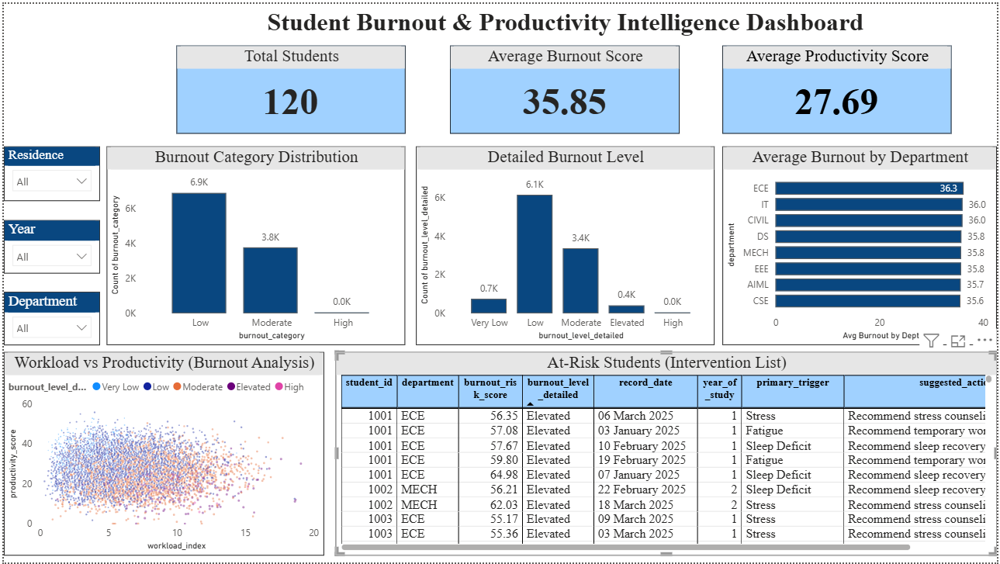

# Student Burnout & Productivity Intelligence System

A data analytics project designed to analyze student behavioral and academic patterns, estimate burnout risk, measure productivity, and generate actionable intervention insights through Python, SQL, and Power BI.

---

## Overview

Student burnout is influenced by multiple factors such as sleep deficit, workload, stress, fatigue, screen distraction, and recovery balance.  
This project builds a complete analytics pipeline that simulates realistic student data, cleans and transforms it, engineers meaningful features, computes burnout and productivity scores, stores the data in a relational database, and visualizes insights using an interactive Power BI dashboard.

The system is designed not just to identify extreme burnout, but also to detect students in elevated risk states for early intervention.

---

## Problem Statement

Institutions often lack a structured system to monitor student wellbeing and productivity using behavioral and academic indicators.

This project addresses questions such as:

- Which students are at burnout risk?
- How do workload and recovery affect productivity?
- Which behavioral factors are most associated with burnout?
- How can moderate-risk students be identified before escalation?

---

## Key Features

- Simulated semester-style student behavioral dataset
- Realistic data imperfections:
  - missing values
  - inconsistent formats
  - outliers
  - duplicates
- Data cleaning and preprocessing pipeline
- Feature engineering for behavioral and workload metrics
- Explainable burnout scoring model
- Productivity scoring model
- Hierarchical burnout classification
- Normalized SQL database design
- Power BI dashboard with intervention-focused insights
- Actionable intervention system with primary trigger identification and suggested actions

---

## Tech Stack

- **Python**
- **Pandas**
- **NumPy**
- **MySQL**
- **SQLAlchemy / PyMySQL**
- **Power BI**
- **Git & GitHub**

---

## Project Pipeline

```text
Raw Data Generation
    ↓
Data Cleaning & Preprocessing
    ↓
Feature Engineering
    ↓
Burnout & Productivity Scoring
    ↓
SQL Database Loading
    ↓
Power BI Dashboarding
```
## Dataset Design

Unlike static public datasets, this project uses a custom-built synthetic data generation approach to simulate realistic student behavioral and academic patterns.

This was done to address:
- lack of publicly available datasets combining behavioral, academic, and wellbeing factors
- need for controlled feature relationships (e.g., workload → stress → burnout)
- ability to model time-series behavior and student lifecycle patterns

The dataset follows a daily time-series structure:

- 120 students  
- 90 days  
- 10,000+ records  

Each row represents:
- one student  
- one day of activity  

This design allows the system to capture evolving behavioral trends rather than static snapshots.


### Core Raw Fields

#### Student attributes
- `student_id`
- `department`
- `year_of_study`
- `residence_type`

#### Daily behavior
- `sleep_hours`
- `study_hours`
- `screen_time_hours`
- `social_media_hours`
- `physical_activity_minutes`
- `class_attendance_hours`
- `break_hours`

#### Academic load
- `assignments_due_count`
- `tests_upcoming_count`
- `submission_deadline_proximity`
- `lab_hours`
- `project_work_hours`

#### Wellbeing
- `stress_level`
- `mood_score`
- `fatigue_level`
- `motivation_score`

---

## Data Cleaning

The raw dataset intentionally includes realistic imperfections to simulate real-world analytics challenges.

### Cleaning steps performed
- standardized mixed date formats  
- converted inconsistent stress values like `"7/10"` and `"High"`  
- handled missing values using mean/median imputation  
- removed duplicate student-date records  
- capped unrealistic outliers  
- converted features to consistent numeric types  

### Result
- raw rows: **11016**  
- cleaned rows: **10661**  

---

## Feature Engineering

The following derived features were created:

- `sleep_deficit`
- `workload_index`
- `distraction_ratio`
- `recovery_balance`
- `deadline_pressure_score`
- `productivity_score`
- `burnout_risk_score`
- `academic_performance_index`
- `primary_trigger` (main contributing factor to burnout)
- `suggested_action` (recommended intervention)

---

## Burnout Scoring Logic

Burnout risk is modeled as a weighted combination of normalized stress-inducing and recovery-related factors.

### Burnout score formula

```text
burnout_risk_score =
    0.17 * sleep_deficit_scaled
  + 0.20 * stress_scaled
  + 0.16 * fatigue_scaled
  + 0.16 * workload_index_scaled
  + 0.10 * deadline_pressure_scaled
  + 0.08 * distraction_ratio_scaled
  - 0.08 * recovery_balance_scaled
  - 0.05 * mood_scaled
```
### Interpretation

- stress, fatigue, workload, and sleep deficit increase burnout risk  
- recovery balance and mood reduce burnout risk  
- final score is clipped to the range **0–100**  

---

## Decision Support Layer

To enhance actionability, the system identifies the primary contributing factor for burnout and recommends targeted interventions.

### Primary Trigger
For each at-risk student, the system determines the dominant contributing factor among:
- sleep deficit
- stress
- fatigue
- workload
- deadline pressure
- distraction

### Suggested Action
Based on the primary trigger, the system generates actionable recommendations:

- Sleep Deficit → Recommend sleep recovery support  
- Stress → Recommend stress counseling  
- Fatigue → Recommend temporary workload reduction  
- Workload → Recommend workload balancing  
- Deadline Pressure → Recommend planning support  
- Distraction → Recommend distraction management  

### Alert Filtering Logic

To avoid alert fatigue, recommendations are generated only for:
- Elevated
- High
- Critical

Students in lower categories are excluded from intervention to maintain focus on high-priority cases.

This transforms the system from a descriptive dashboard into a decision-support system.
---

## Classification System

### Primary classification
- **Low**: 0–39  
- **Moderate**: 40–69  
- **High**: 70–100  

### Detailed classification
- **Very Low**: 0–19  
- **Low**: 20–39  
- **Moderate**: 40–54  
- **Elevated**: 55–69  
- **High**: 70–84  
- **Critical**: 85–100  

### Design insight
The detailed classification helps identify students in the **Elevated** range, which is useful for early intervention before they move into high burnout states.

---

## SQL Database Design

The processed data is normalized into a relational schema:

### Tables

#### `dim_students`
Static student information  

#### `fact_daily_metrics`
Daily behavior and routine metrics  

#### `fact_academic_load`
Academic pressure and workload metrics  

#### `fact_intelligence_scores`
Engineered features, productivity, and burnout outputs  

This design makes the project more scalable and system-oriented instead of relying on a single flat table.

---

## Dashboard Highlights

The Power BI dashboard includes:

### KPI cards
- Total Students  
- Average Burnout Score  
- Average Productivity Score  

### Visuals
- Burnout category distribution  
- Detailed burnout level distribution  
- Average burnout by department  
- Workload vs productivity scatter analysis  
- At-risk student intervention table with trigger-based recommendations
### Interactivity
- slicers for:
  - department  
  - year  
  - residence type  

---

## Dashboard Preview



---

## Key Insights

- Most observations fall into **Low** and **Moderate** burnout categories  
- The **Elevated** group is especially important for early detection  
- Burnout patterns are more strongly linked to behavioral factors such as workload, sleep, and recovery than to department alone  
- Productivity does not increase indefinitely with workload and may decline at higher stress levels  
- The intervention table helps identify students requiring attention based on detailed burnout classification  
- The system provides actionable recommendations by identifying the primary cause of burnout for each at-risk student
  
---

## Repository Structure

```text
student-burnout-productivity-intelligence/
│
├── data/
│   ├── raw/
│   ├── cleaned/
│   └── processed/
│
├── python/
│   ├── generate_raw_dataset.py
│   ├── data_cleaning.py
│   ├── feature_engineering.py
│   └── load_to_mysql.py
│
├── sql/
│   ├── schema.sql
│   └── queries.sql
│
├── powerbi/
│   └── dashboard.pbix
│
└── README.md

```
## How to Run

### 1. Generate raw dataset
```bash
python python/generate_raw_dataset.py
```

### 2. Clean the dataset
```bash
python python/data_cleaning.py
````
### 3. Create engineered features and scores
```bash
python python/feature_engineering.py
```
### 4. Load processed data into MySQL
```bash
python python/load_to_mysql.py
```


### 5. Create SQL schema and run queries

Execute the scripts in the `sql/` folder using MySQL Workbench.

### 6. Open the Power BI dashboard

Load the SQL tables or processed dataset into Power BI and open the dashboard file.

---

## Future Improvements

- weekly trend and burnout velocity analysis  
- stronger departmental differentiation in synthetic data generation  
- predictive modeling for early risk escalation  
-automated email/SMS alert system for real-time intervention
- historical trend comparison across semesters  

---

## Project Outcome

This project demonstrates how behavioral, academic, and wellbeing data can be transformed into an interpretable student burnout intelligence system.

It goes beyond visualization by incorporating feature engineering, risk scoring, classification, and a decision-support layer that identifies the primary cause of burnout and recommends targeted interventions for at-risk students.
---

## Author

**Pooja S Lal**
